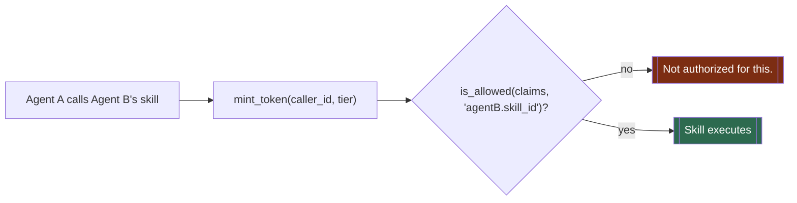
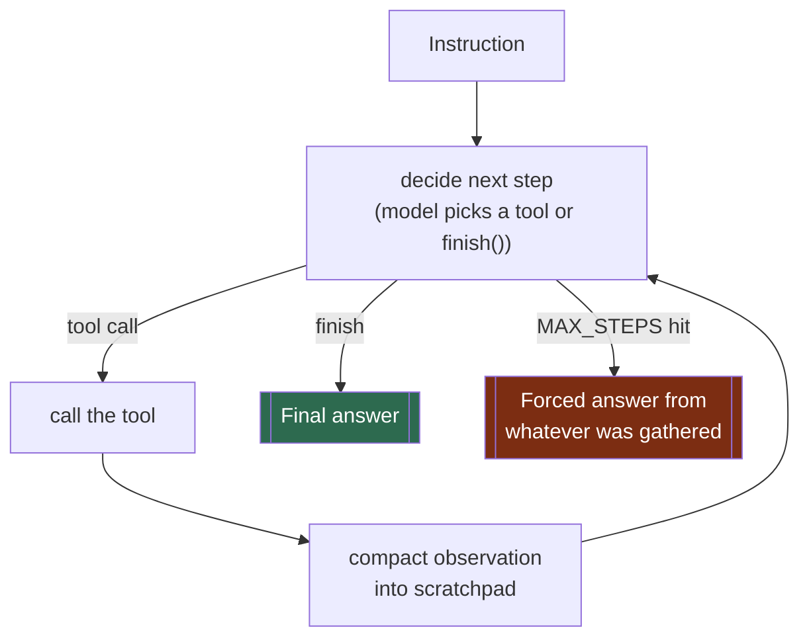
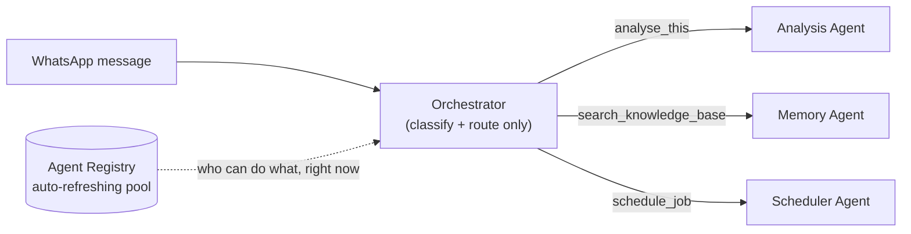
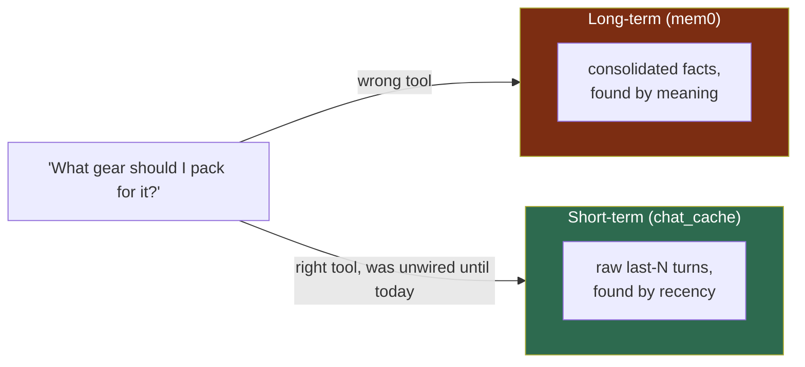
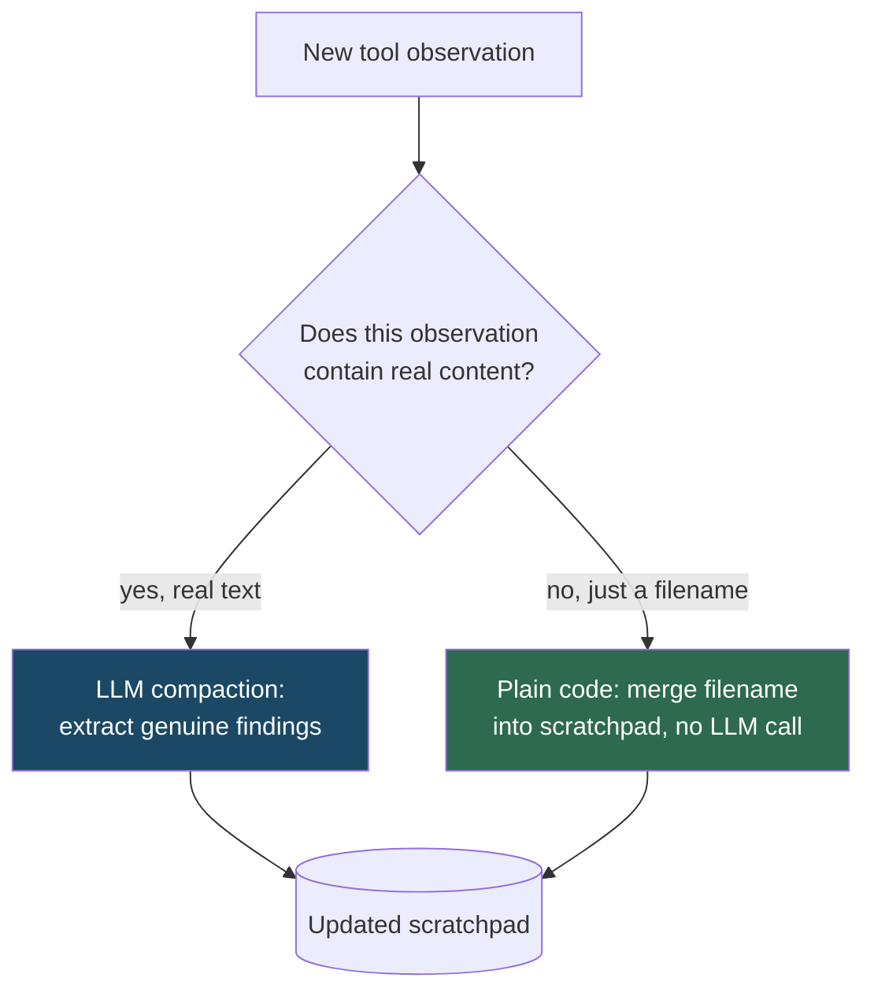
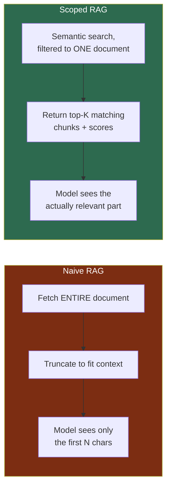
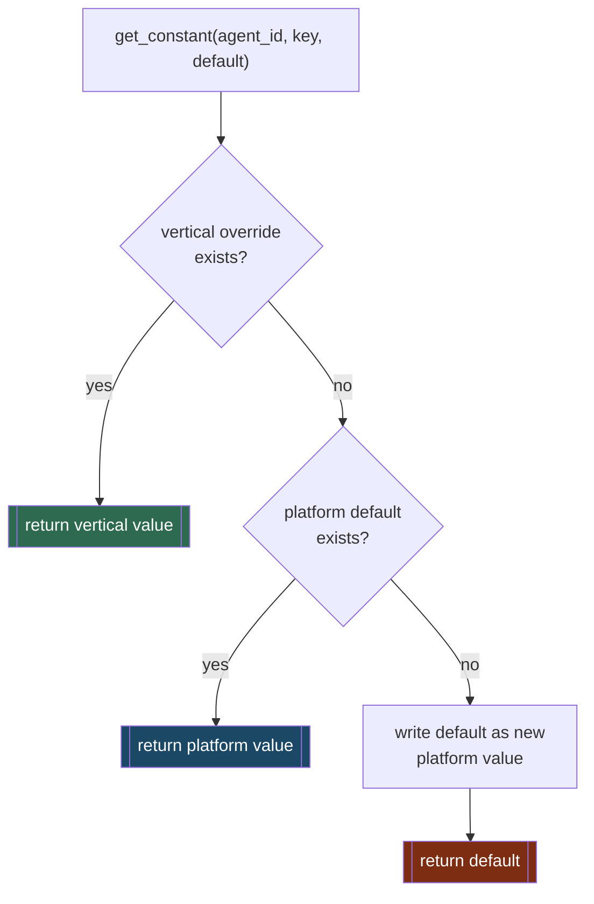

# Adiyan Engineering Notes — Instagram Series Source Material

Every fact, code path, and incident below is real — pulled directly from Adiyan's actual codebase and this session's live debugging (Phoenix traces, log lines, actual test messages sent/received). Nothing here is a hypothetical or invented example. File paths are exact; use them to re-verify anything before posting.

---

## 1. Permission Groups

**Where:** `mesh/lib/permissions_config.json`, enforced via `mesh/lib/permissions.py`'s `mint_token()` / `is_allowed()`.

**The design:** three tiers, not a single flat allow-list.
- `owner` — `"allow": ["*"]`, wildcard, full access.
- `service` — internal machine-to-machine calls (cron firing a job, one agent calling another while composing a reply). Explicitly *not* `"*"` — scoped to exactly what today's flows need.
- `standard` — default tier for a newly registered WhatsApp client.

Every skill call checks `is_allowed(claims, f'{AGENT_ID}.{skill_id}')` before dispatch — a caller with the wrong tier gets a flat `'Not authorized for this.'` rejection, no partial execution.

**Real incident:** today, adding a new tool (`search_within_document`, a document-scoped RAG search) required adding `"memory.search_document_chunks"` to the `service` tier's allow-list — forgetting this step would have made the new tool fail with a silent auth rejection despite the code being otherwise correct. Permissions are a real, separate failure surface from logic bugs.

---

## 2. ReAct Loop — When To Use It

**Where:** `mesh/analysis/skills/analyze.py` — Analysis Agent's `analyse_this` skill.

**The design:** Reason → Act → Observe → repeat, up to `MAX_STEPS = 10`, ending when the model calls `finish()` or the step cap forces a final answer from whatever's gathered. The model decides its *own* next move each step (search a document, read one, recall memory, consult another agent) — not a fixed pipeline.

**When NOT to use it:** a single-fact lookup with no multi-step reasoning needed. Memory Agent's `search_knowledge_base` skill (`mesh/memory/skills/search_kb.py`) is a single, fixed vector-search call — no loop, no tool selection, because the task doesn't need one. `analyse_this`'s own skill description explicitly draws this line: *"General-purpose reasoning... not a single stored fact."*

**Real incident:** the ReAct loop's own tool-observation handling produced two separate hallucinations this session — `search_documents` returning a bare filename got fed to the compaction step, which fabricated a "quote" and even a wrong port number, attributed confidently to a real file. Fixed by code-enforcing that filename-only observations never reach the LLM extraction step (`_merge_search_result`). A ReAct loop is only as safe as its weakest tool-observation handling, not just its top-level prompt.

---

## 3. Why Orchestrator + Multi-Agent, Not One Monolith

**Where:** `mesh/orchestrator/`, `mesh/mcp/agent_registry/`, each agent (`analysis`, `memory`, `scheduler`, `journal`, `config_agent`) as its own A2A server.

**The design:** Orchestrator never does the actual work — it classifies an incoming message, routes it to the right agent over A2A, and hands the reply back. Each agent is independently deployable, independently restartable, discoverable at runtime via the Agent Registry rather than a hardcoded skill list.

**Real incident, the exact cost of getting this wrong:** the Agent Registry originally loaded its agent pool *once*, at Orchestrator's own startup. Analysis Agent's heavier imports made it register slightly late — after Orchestrator's snapshot window closed — so it was permanently unroutable until Orchestrator itself restarted. Fixed with `registry_client.start_auto_refresh()`, a background poller instead of a one-time snapshot. A monolith doesn't have this specific bug — but it also can't restart one broken subsystem without restarting everything, and this codebase was rebuilt from an actual retired monolith (`Adiyan_monolith_backup/`) specifically to avoid that.

---

## 4. Memory, In Detail

**Where:** `mesh/memory/memory_index.py` (documents), `mesh/memory/mem0_backend.py` (long-term conversation), `mesh/lib/chat_cache.py` (short-term conversation).

Three genuinely separate stores, not one "memory" blob:
1. **Knowledge base** (`memory_index.py`) — uploaded documents, chunked (800 chars, 100 overlap via LlamaIndex `SentenceSplitter`), embedded (`nomic-embed-text`), stored in Qdrant.
2. **Long-term conversation memory** (`mem0_backend.py`) — mem0-backed, extraction + consolidation pipeline, "what do I durably know about this person."
3. **Short-term chat cache** (`chat_cache.py`) — a plain in-process rolling window of the last few raw turns, not persisted, wiped on restart.

**Real incident:** these three get confused for each other constantly, and the confusion is a real bug source, not just a naming nitpick — see #5.

---

## 5. Long-Term vs. Short-Term Memory

**The distinction, in one line:** long-term memory finds what's relevant *by meaning*, over any time horizon. Short-term memory finds what happened *most recently*, verbatim, regardless of meaning.

**Real incident — today, live:** a user said *"I really enjoy trekking in the Himalayas,"* got acknowledged, then asked *"What gear should I pack for it?"* Adiyan asked "which activity?" — it never resolved "it." Root cause, confirmed via Phoenix trace: the ReAct loop correctly tried `recall_memory` (the **long-term**, mem0-backed tool) four separate times with different phrasings — but that's the wrong store for "what was just said two messages ago." The **right** mechanism, `chat_cache.py`, was already being written to correctly on every turn (`remember_turn()`) — but its read function, `get_recent_turns()`, had **zero callers anywhere in the codebase**, confirmed by a full-repo grep. A short-term memory system existed, was populated correctly, and was never read. That's not a bug in the memory logic — it's a bug in wiring.

---

## 6. Message Compaction Techniques

**Where:** `mesh/analysis/skills/analyze.py`'s `_compact()`, `_merge_document_list()`, `_merge_search_result()`.

**The core idea:** the ReAct loop's decide-step never sees the raw history of every prior tool call — only a compact, structured "scratchpad" (a Pydantic model: `findings`, `documents_checked`, `documents_known`, `agents_consulted`, `open_questions`). After every tool call, a separate compaction step merges the new observation into an *updated* scratchpad — never just appends. This is what lets a 10-step investigation run on a local 16k-token model without overflowing context.

**The sharper lesson — not every observation should go through LLM compaction.** Confirmed live, twice, in this exact codebase: when a tool's output is genuinely content-free (a bare filename, a list of filenames — nothing an LLM could correctly call a "finding"), asking an LLM to "extract findings" from it doesn't fail safely — it fabricates something plausible-sounding instead. The fix both times was the same: bypass the LLM compaction step entirely for that tool's output, and merge it into the scratchpad with plain code instead. Compaction is a real technique with a real failure mode, and the fix is knowing *when not to compact with an LLM at all*.

---

## 7. RAG — How To Design a Scalable One

**Where:** `mesh/memory/memory_index.py`'s `search_within_document()`, built today, vs. the older `get_document_text()`.

**The naive version, and where it breaks:** `get_document_text()` concatenates *every* chunk of a document into one string, then a caller-side cap truncates it. Fine for a short note. For a 167-chunk book, the truncated text never got past the cover page and table of contents — the actual passage asked about, deep in the middle, was never seen. The model didn't error — it fabricated a plausible-sounding quote instead.

**The scalable version:** don't fetch the whole document — search *within* it. `search_within_document()` reuses the exact same LlamaIndex retriever Adiyan already had for whole-KB search, just scoped with a Qdrant metadata filter to one document's chunks (`MetadataFilters(filters=[MetadataFilter(key='source_filename', ...)])`). Same infrastructure, narrower scope, genuinely relevant results with real similarity scores and chunk positions for citation.

**Verified live:** asked which port Qdrant runs on and why (a fact buried in the middle of a project doc), the naive path fabricated a wrong port number with a fake justification. After the fix, the correct chunk was retrieved (relevance 0.76) and the real port number, correctly cited, came back.

---

## 8. Evals and Why They Matter

**Where:** `mesh/evals/EVAL_DESIGN.md`.

**The design:** structural checks (deterministic, no LLM — did the right tool get called, was a type correct) plus LLM-judge checks (semantic — is this answer actually grounded in what was retrieved). Test cases aren't hypothetical — every one is mapped to a real bug already hit in production. The fixture data is the project's own real documentation, ingested into a test namespace, so ground truth is knowable and checkable by hand.

**Why it matters, concretely — not abstractly:** running through exactly three hand-crafted eval-style test cases in one session surfaced three real, previously-unknown bugs: a fabricated quote from a document that was never actually read in full, a skill-classification rejection that silently dropped a legitimate request, and a structural gap where a caller's identity never reached a tool that needed it. None of these were found by writing code carefully — they were found by testing specific, adversarial-but-realistic cases and checking the actual output against ground truth, not by "it looks plausible."

---

## 9. Telemetry — Baking It In

**Where:** `mesh/observability/tracing.py`'s `setup_tracing()`, Arize Phoenix, called once at every agent's own startup.

**The design:** every agent auto-instruments its own LangChain and A2A calls the moment it starts — not opt-in per call site, not something a developer has to remember to add. Every LLM call, every tool call, every classify/extract step shows up as a real span, with real inputs and outputs, queryable later.

**Why this matters, not as theory but as the actual debugging method used today:** every single bug documented in this file was root-caused by pulling a real Phoenix trace via its GraphQL API and reading the *actual* tool inputs/outputs — not by guessing, not by re-reading code and reasoning about what "should" happen. A hallucinated quote was caught by comparing the trace's real retrieved chunk text against the model's final answer, character by character. Without telemetry already baked in from day one, none of today's fixes would have been possible to root-cause with any confidence — every fix would have been a guess.

---

## 10. Scalable, Pluggable AI Platform Design

**Where:** `mesh/lib/config_sdk.py`, `mesh/lib/registry_client.py`, the vertical-activation mechanism.

**The design, in one sentence:** every agent's prompts, model settings, and tunables live in one place (MongoDB via `config_sdk`), resolved through a two-layer lookup — an optional vertical override, then a shared platform default — with the calling agent's own hardcoded value used only as a first-run seed, never read again after that.

**The pluggability payoff:** a business-vertical agent (e.g. a future `gym_trainer` persona) can override any platform agent's prompt for its own deployment, with zero code changes anywhere else — activating a vertical is a single write (`set_active_vertical_id()`) that every later config read across the whole mesh picks up automatically. Verified live: activating a vertical changed Analysis Agent's grounding behavior instantly, while leaving Orchestrator (which had no override for that vertical) completely unaffected — confirming layers stay properly isolated.

**The other half of "pluggable":** the Agent Registry doesn't just discover agents once — a background poller re-registers an agent whenever the active vertical changes, so the registry's own record of "what can this agent do" stays honest even as its skill descriptions change live, not just at startup.

---

*Every incident cited above happened during actual development/testing of Adiyan — verify against the file paths given before publishing, since the codebase will keep evolving.*
