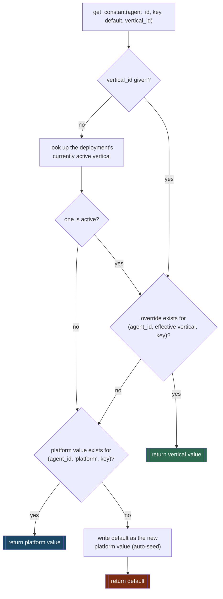
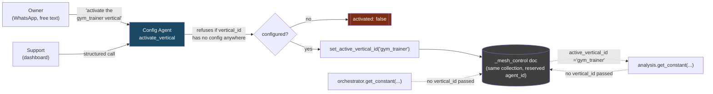
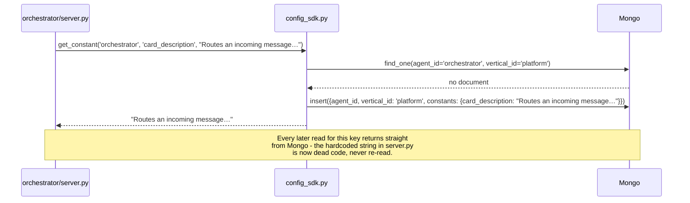

# Config SDK Architecture

Every agent's prompts, model settings, and tunables live in one MongoDB collection (`agent_config`), reached only through `mesh/lib/config_sdk.py`. No agent talks to Mongo directly except through this module, and nothing outside it knows the schema.

## Resolution: vertical override, then platform, then code

A read never just checks one place. If the caller didn't name a vertical explicitly, it uses whatever's currently *activated* deployment-wide (see below) — then falls back to the shared platform default, and only falls back to the hardcoded value in the calling agent's own Python if Mongo has nothing at all, at which point it writes that value back as the new platform default.



The write only ever happens on that last path. A vertical agent overriding a platform prompt is always a deliberate `set_constant(..., vertical_id=...)` call from somewhere — never an accidental side effect of a read that happened to miss. Notice that a caller (`handle_message.py`, `analyze.py`, anything) never has to know or pass which vertical is active — that's the point of the next section.

## Activating a vertical: one switch, every agent

A vertical isn't selected per-request. It's a single deployment-wide setting — activate `gym_trainer` once, and *every* agent's later config reads that don't pass their own `vertical_id` start resolving against it automatically, with zero code changes anywhere else.



The "currently active vertical" is itself stored as a constant, in the same collection, under a reserved pseudo-agent-id (`_mesh_control`) — not a second Document type. `deactivate_vertical` reverts to `None`, which is the same as "run plain platform defaults."

`activate_vertical` checks first that the target vertical actually has *some* configuration on file (via `list_vertical_ids()` across every known agent) before switching — a typo'd vertical name can't silently strand the deployment on empty overrides. Confirmed live: activating `'nonexistent_vertical'` returns `{'activated': False, ...}` and changes nothing.

## First run: code becomes seed, not source

Before this existed, `mesh/orchestrator/constants.py` and `skills_catalog.py` *were* the configuration. Now they're only the values Mongo starts from. The first time any process asks for a key that isn't in Mongo yet, whatever's hardcoded in that file is what gets written there:



This is why the migration is incremental, not a rewrite: an agent's local files still work as defaults on a fresh database, and adding one more `get_constant()` call is what "moves" a value into Mongo - nothing is deleted from the Python side.

## What's actually migrated today

**Orchestrator**, the original pilot:

| Local source (fallback only, no longer read directly) | Mongo key | Fetched |
|---|---|---|
| `constants.py`: `HOST`, `PORT` | `host`, `port` | once, at process startup — a listening socket can't change mid-process |
| `constants.py`: `WHATSAPP_MCP_URL` | `whatsapp_mcp_url` | every incoming message |
| `server.py`: AgentCard description string | `card_description` | once, at startup |
| `mcp_config.json`: `mcp_servers` list | `mcp_servers` | once, at startup |
| `skills_catalog.py`: each skill's `description`/`examples` | `skill_<id>_description`, `skill_<id>_examples` | on every classify call |
| `runtime_config.json`: all 6 stage settings | `stages.<name>` | every incoming message |
| `humanize.py`: the reply-writing prompt template | `humanize_prompt_template` | every reply |

**Analysis Agent**, second pilot, same pattern plus one new category:

| Local source | Mongo key | Fetched |
|---|---|---|
| `constants.py`: `HOST`, `PORT` | `host`, `port` | once, at startup |
| `server.py`: AgentCard description | `card_description` | once, at startup |
| `mcp_config.json`: `mcp_servers` | `mcp_servers` | once, at startup |
| `skills_catalog.py`: `analyse_this`'s `description`/`examples` | `skill_analyse_this_description`, `skill_analyse_this_examples` | on every classify call |
| `runtime_config.json`: all 3 stages (`classify_skill`, `extract_parameters`, `react`) | `stages.<name>` | every request |
| `analyze.py`: 6 of the ReAct loop's error/tool-observation strings | `msg_no_matching_document`, `msg_document_not_found`, `msg_kb_empty`, `msg_no_contact`, `msg_nothing_in_memory`, `msg_no_agents_discoverable`, `msg_agent_not_registered`, `msg_unknown_tool`, `msg_no_clear_answer` | on the path that would return that message |

Deliberately **not** migrated from `analyze.py`: the exception-interpolated diagnostic strings (`f'search_documents failed: {e}'` and five siblings - always ending in a raw Python exception regardless of vertical, no real customization value) and the ReAct loop's own reasoning prompts (`_decide_next_step`/`_compact`/`_final_answer`, the 7 tool docstrings) - a separate, not-yet-agreed piece of scope, since editing those risks quietly degrading the loop's own reliability for a benefit nobody's asked for yet.

`id`, `name`, `tags`, `input_modes`, `output_modes` stay fixed in code deliberately for every skill - they're wiring (dispatch keys off `id`), not prompt content.

## Keeping the registry honest

Activating a vertical changes an agent's own internal classify decisions instantly (`get_skills()` resolves live), but the Agent Registry only ever learns an agent's skills by fetching its `/.well-known/agent-card.json` once, at registration time - never again on its own. Two pieces in `mesh/lib/bootstrap.py`, shared by every agent, close that gap:

- `skills_refresher` (optional, passed to `serve()`): the served agent-card is rebuilt from it on every fetch, not baked in once. `AgentCard` is a raw protobuf message (confirmed - no Pydantic `model_copy()`), so this is a `deepcopy` + `ClearField('skills')` + `.extend()` on the repeated field, not a plain attribute reassignment.
- A background poller (always runs, 30s cadence): watches `get_active_vertical_id()` for changes and re-registers with the Agent Registry when it changes - which is what actually makes the registry re-fetch and store the now-current card.

Wired into Orchestrator and Analysis Agent so far, since both already have a `get_skills()`.

## Who's allowed to write

Config Agent is the only thing with write access from a natural-language path. Six skills, all owner-tier, all reachable both ways (WhatsApp free text *and* the dashboard's structured calls, which proxy through a minted owner token):

| Skill | Does |
|---|---|
| `query_config` | read one setting, or everything for one agent |
| `update_config` | change a constant/toggle (not stage settings) |
| `activate_vertical` | switch the deployment onto a vertical's overrides |
| `deactivate_vertical` | revert to plain platform defaults |
| `get_active_vertical` | which vertical (if any) is running now |
| `get_all_configs` / `update_stage_config` | dashboard-only, structured calls, not NL-routable |

A future vertical agent itself writes the same way any other config-writing caller does - through `config_sdk.set_constant(..., vertical_id=...)` directly, since it's mesh-internal code, not an external NL surface.

## Verified live

The full activation loop, run against the real database, no mocking:

```
get_active_vertical()                                        → {'active_vertical_id': None}
get_constant('analysis', 'strict_grounding', True)            → True   (platform default)

activate_vertical('nonexistent_vertical')                     → {'activated': False, ...}   (refused, unconfigured)

set_constant('analysis', 'strict_grounding', False,
              vertical_id='gym_trainer')                      # a vertical override, written once
activate_vertical('gym_trainer')                               → {'activated': True, ...}

get_constant('analysis', 'strict_grounding', True)             → False  ← same call as above, ZERO code
                                                                          changed in analyze.py itself
get_constant('orchestrator', 'card_description', ...)          → unaffected — orchestrator has no
                                                                   gym_trainer override, falls to platform

deactivate_vertical()                                          → {'deactivated': True, 'was_active': 'gym_trainer'}
get_constant('analysis', 'strict_grounding', True)              → True   (back to platform)
```

One write to activate. Every later config read across the whole mesh picks it up automatically. Deactivating is exactly as cheap.
