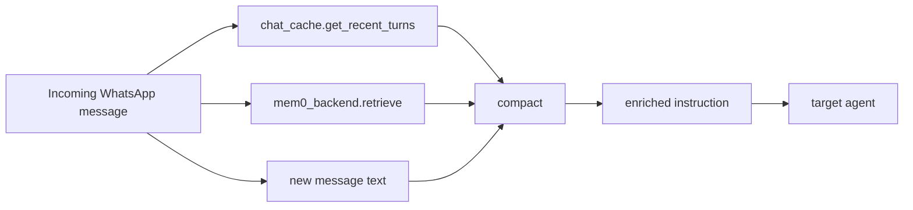
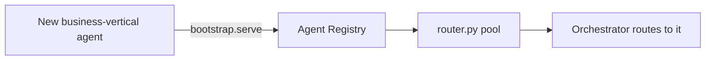

# MVP Hardening Plan: Compaction Engine + Sub-Agent Support

## Research

**Compaction:**
- [MemGPT](https://informationmatters.org/2025/10/memgpt-engineering-semantic-memory-through-adaptive-retention-and-context-summarization/) — context = RAM, external memory = disk, summarization at the boundary. Maps to `chat_cache` (RAM) + `mem0` (disk) + `compact()` (the summarization step).
- [Microsoft Agent Framework: Compaction](https://learn.microsoft.com/en-us/agent-framework/agents/conversations/compaction) — pinned head / compressible prefix / recent tail. Template for `compact()`'s join-or-summarize logic.
- [Mem0: Compression vs. Memory](https://mem0.ai/blog/context-compression-vs-memory-in-ai-agents) — compression (fit this prompt) and memory (what's worth keeping) are separate concerns. `mem0` keeps owning the second; `compaction.py` only does the first.

**Sub-agents:**
- [Microsoft: Orchestrator/subagent patterns](https://learn.microsoft.com/en-us/agents/architecture/multi-agent-orchestrator-sub-agent) — orchestrator delegates to specialist subagents, including externally-owned ones. Matches a marketplace-installed agent.
- A2A protocol's own discovery model — Agent Card + registry, no hardcoded URLs. `agent_registry` + `router.py` already implement this, which is why direct routing to sub-agents was free.

---

## 1. Compaction Engine

`mesh/lib/compaction.py`, one function:

```python
async def compact(pieces: List[str], budget_chars: int, cfg: Dict) -> str
```

Under budget → join and return, no LLM call. Over budget → one LLM call, merges into a shorter version, recent/specific info kept verbatim, older info summarized.

Config (per-agent, via `config_sdk`):
- `<agent_id>.compaction_enabled` (default `True`)
- `<agent_id>.compaction_budget_chars` (default sized to `qwen3:8b-16k`'s real context, not a guess)

### Flow



Runs in Orchestrator's `run()`, every routed message, before calling any target agent. This is `chat_cache`'s first real reader — it's been write-only since it was built.

### Worked example: the tennis case

| | Before | After |
|---|---|---|
| Turn 1 | "I like to play tennis" → stored in `chat_cache` + `mem0` | same |
| Turn 2 | "Explain the rules of the game" | same input |
| What Analysis Agent received | `instruction = "Explain the rules of the game"` | `instruction = "Explain the rules of the game.\n\nRecent conversation: user mentioned playing tennis.\nKnown from memory: user enjoys tennis as a recreational activity."` |
| Result | asked "which game?" | explains tennis rules directly |

The fix doesn't rely on the ReAct loop *choosing* to call `recall_memory` — the context is already attached before the loop starts.

### Out of Scope
Analysis Agent's own `_compact()` (scratchpad bookkeeping between ReAct steps) is a different concern and stays as-is. `compact()` is a plain function any agent can import later if its own context grows past budget — no second caller wired in this pass.

---

## 2. Sub-Agent Support

### As-Is
`router.py` builds Orchestrator's routing pool from the live Agent Registry, every call. Any agent using the shared `bootstrap.serve()` self-registers and is immediately routable. No code change needed.



### Missing: a scaffold

`python -m mesh.tools.new_agent_scaffold <agent_id> <port>` generates `mesh/<agent_id>/`:

- `server.py`, `agent_executor.py`, `skills_catalog.py`, `constants.py`, `runtime_config.json`, `mcp_config.json` — matching every existing agent's shape.
- Prints a reminder to manually add an entry to `permissions_config.json` and `start_all.sh` — cross-cutting files, not auto-edited.

Example: a "gym trainer" vertical agent —

```
python -m mesh.tools.new_agent_scaffold gym_trainer 8428
→ mesh/gym_trainer/server.py, agent_executor.py, skills_catalog.py, ...
→ "Add gym_trainer to permissions_config.json and start_all.sh"
```

Fill in one real skill, restart the mesh, it's routable from WhatsApp — same registry mechanism as Orchestrator/Analysis/Memory today.

---

## Sequencing

1. `compaction.py` + budget-size decision + config_sdk wiring
2. Wire into Orchestrator's `run()`
3. `new_agent_scaffold.py`
4. Re-run the tennis case live, confirm fixed
