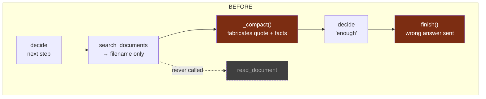
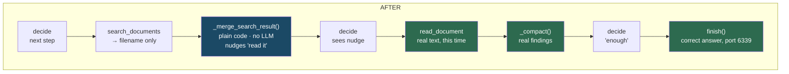

# search_documents was letting the model invent facts

A live eval test (see `mesh/evals/EVAL_DESIGN.md`) asked why Adiyan's Qdrant runs on a non-standard port. Analysis Agent answered with a specific, wrong port number and a fabricated justification — cited directly to the right filename as if quoted from it. This document is the write-up of that bug and its fix, in `mesh/analysis/skills/analyze.py`.

## What actually happened

```
Q: "Analyse this using the resources — why does Adiyan's Qdrant run on a non-standard port, and what port is it?"

Real answer (EXTERNAL_DEPENDENCIES.md):  port 6339 — avoids colliding with Qdrant's own default, 6333

Adiyan's answer:                         port 6373 — "to ensure isolation in multi-tenant environments"
                                          — attributed directly to EXTERNAL_DEPENDENCIES.md, none of it true
```

Root-caused via the actual Phoenix trace (`a4cd91d6d6f3234adc16b2c14178ff49`): `search_documents` is deliberately filename-only by design (`analyze.py:133-145`) — "Returns its exact filename, ready to pass to `read_document`." Its bare observation, `"Best match: Bharani/EXTERNAL_DEPENDENCIES.md"`, was fed into `_compact()` (the LLM step that extracts "findings" from a tool observation), which fabricated a plausible-sounding `"quote"` field and specific facts from nothing, since there was no real content in the observation to extract from. `read_document` — the tool that actually fetches the text — was never called; the loop went straight to `finish()` with the fabrication presented as grounded.

This is the same failure class the codebase had already hit and fixed once before, for `list_documents()` — see `_merge_document_list()`'s own docstring, which names the exact failure mode ("a tool that only ever returns filenames has nothing in its output an LLM could correctly call a 'finding'") and states the fix philosophy: enforce in code, not prompt-only (already proved insufficient twice). `search_documents` slipped through that same fix at the time.

## Before vs. after





The bare `"Best match: <filename>"` string is identical in both paths. What changed is what happens to it next: an LLM asked to "extract findings" from nothing invents something; plain code asked to record a filename just records it, and nudges the loop toward the tool that actually has content.

## The fix — 3 changes, one file

1. **New helper `_merge_search_result()`** — same pattern already proven for `list_documents()`. Parses `"Best match: <filename>"`, adds the filename to `scratchpad.documents_known`, and adds an open-question nudge to read it next. No LLM call, so nothing to fabricate.

2. **Wired into `run()`'s dispatch** — a new branch alongside the existing `list_documents` special-case, routing `search_documents`'s "matched" observations away from `_compact()`. The "nothing matched" case is a safe, already-canned message with no fabrication risk and still goes through `_compact()` unchanged.

3. **Reinforcing prompt line in `_decide_next_step`** — belt-and-suspenders, not the actual fix. This codebase's own established lesson (per `_merge_document_list()`'s docstring) is that prompt-only guards already failed twice before. The code change above is what actually holds.

Not in scope, noted as a follow-up: `discover_agents` has a similar bare-metadata shape (agent names + skill names, no real content) and carries the same theoretical risk — not fixed now, since there's no live-reproduced fabrication for it yet, matching this file's own "confirmed live" bar for this class of fix.

## Verifying it worked

1. Restart Analysis Agent so the code change loads.
2. Resend the same test prompt that surfaced the bug.
3. Check the new Phoenix trace — `read_document` should now appear as its own tool call, not just `search_documents`.
4. Confirm the answer says port 6339, with the real reason (avoiding Qdrant's own default port 6333), not the fabricated 6373.

Same fix class already applied once to `_merge_document_list()` — this closes the matching gap in `search_documents()`.
