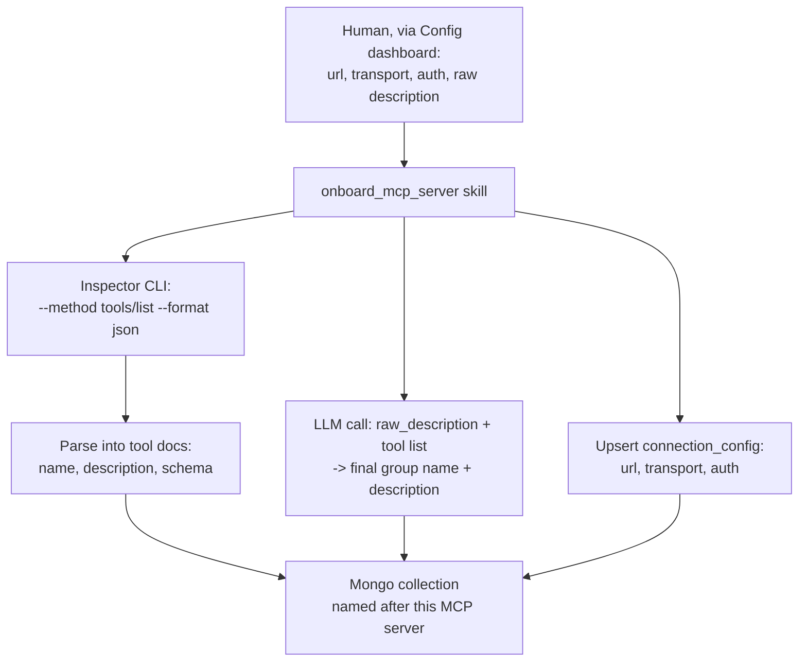
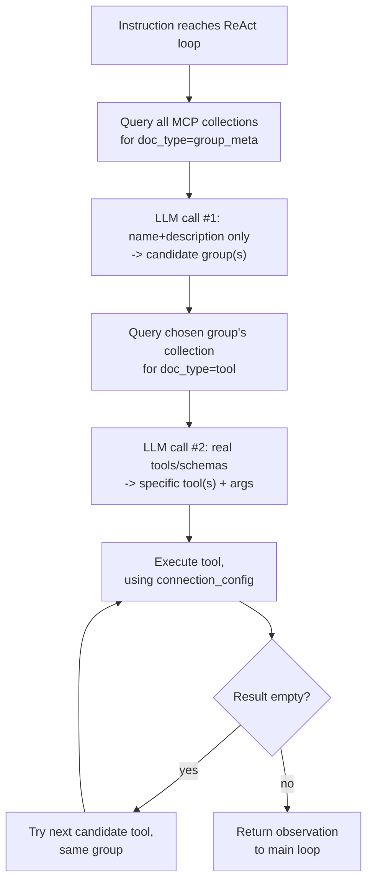

# Tool Resolution — Design

Status: designed, not yet built.

## Registry

One Mongo collection per MCP server, named after that server's id. Three
document types in each collection:

```js
// one per collection
{ doc_type: "connection_config",
  url: "http://127.0.0.1:3000/mcp",
  transport: "http",
  auth: { type: "none" | "bearer" | "header", token: "...", headers: {...} } }

// one per collection
{ doc_type: "group_meta",
  name: "internal_database",
  description: "This deployment's own configuration, settings, and internal state." }

// one per real function
{ doc_type: "tool",
  name: "mcp_0_find",
  description: "Run a find query against a MongoDB collection.",
  schema: { ... } }
```

## Onboarding

A Config Agent skill: `onboard_mcp_server(url, transport, auth, raw_description)`.

1. Run MCP Inspector's CLI against the server:
   `npx @modelcontextprotocol/inspector --cli <url> --transport <transport> --method tools/list --format json`.
2. Parse the output into one `tool` document per entry: `name`, `description`,
   `schema`, taken directly from what Inspector returns.
3. Pass `raw_description` (entered by a human in the Config dashboard) and the
   fetched tool list to an LLM call. The LLM produces the final `name` and
   `description` stored in `group_meta`.
4. Upsert `connection_config`, `group_meta`, and every `tool` document into
   the collection named after this MCP server.

No agent restart is part of this flow. Resolution (below) reads the registry
directly from Mongo on every instruction.



## Resolution

Per instruction, inside an agent's ReAct loop:

1. Query `doc_type: "group_meta"` across every registered MCP collection.
   LLM call #1 picks candidate group(s) from name + description.
2. Query `doc_type: "tool"` within each chosen collection. LLM call #2 picks
   specific tool(s) and arguments from the real name, description, and
   schema.
3. Execute the picked tool(s), using that collection's `connection_config`
   document for connection details. If a result is empty, try the next
   candidate tool in the same group before returning a not-found result.



## Library

`mesh/lib/tool_resolution.py`:

```python
@dataclass
class ToolGroup:
    name: str
    description: str
    tools: List[BaseTool]

async def select_groups(instruction: str, groups: List[ToolGroup], cfg) -> List[str]
async def select_tool_calls(instruction: str, groups: List[ToolGroup], cfg) -> List[ToolCallPlan]
async def execute_tool_calls(plans: List[ToolCallPlan]) -> List[Observation]
async def resolve_and_execute(instruction: str, groups: List[ToolGroup], cfg) -> List[Observation]
```

`ToolGroup` instances are constructed from the Mongo registry at agent boot,
one per registered MCP collection. An agent does not hand-write them.

## config_sdk

The `mcp_servers` constant is removed. The Mongo registry is the only source
of MCP server configuration.

## Rollout

Analysis Agent is the first consumer.

## Resolved decisions

- `resolve_and_execute` is bound alongside the existing direct tools
  (`finish`, `recall_memory`, `search_documents`, `read_document`,
  `search_within_document`, `discover_agents`, `consult_agent`) - it is not
  the only tool the main loop sees. Those tools are unchanged.
- Group and tool candidates are tried one at a time, in order - no parallel
  group or tool resolution.
- `mcp_servers` (`config_sdk`) is removed. The Mongo registry is the only
  source of MCP server configuration.
- `onboard_mcp_server` is a Config Agent skill, DataPart-only (dashboard),
  owner-tier by omission from the service/standard permission tiers, same
  convention as `get_all_configs`/`update_stage_config`.
- The group description is not the human's raw input verbatim - an LLM call
  (`describe_group` stage, Config Agent) produces the final `name` and
  `description` from the human's raw note plus the real fetched tool list.

## Built

- `mesh/lib/mcp_registry.py` - the registry read/write layer.
- `mesh/lib/tool_resolution.py` - `ToolGroup`, `select_groups`,
  `select_tool_call`, `execute_tool_call`, `resolve_and_execute`.
- `mesh/config_agent/skills/onboard_mcp_server.py` - Inspector-CLI fetch +
  `describe_group` LLM call + registry upsert, registered in
  `mesh/config_agent/agent_executor.py`'s `SKILL_HANDLERS`. New
  `describe_group` stage in `mesh/config_agent/runtime_config.json`.
- `mesh/analysis/skills/analyze.py` migrated: `_make_connection_interceptor`
  and `_load_mcp_tools` removed, the `mcp_servers` constant read removed,
  the appended Mongo-tool-names prompt block removed, `resolve_and_execute`
  added to `_make_tools()`.

## Not yet done

- No MCP server has actually been onboarded through `onboard_mcp_server` -
  the registry is empty until someone calls it for `mongo_mcp`.
- No agent has been restarted to pick up the `analyze.py` changes.
- Live end-to-end verification (a real WhatsApp question resolving through
  the new path) has not been run.
