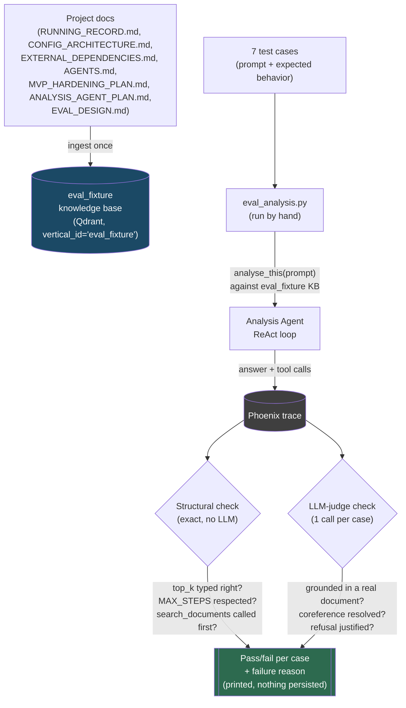

# Analysis Agent Eval

A by-hand quality check for Analysis Agent's `analyse_this` skill (the ReAct loop in `mesh/analysis/skills/analyze.py`), run manually whenever its prompts or config change. Not CI-wired, not automated — you run it, you read the output.

## Why this exists

Every case below maps to a real bug hit during this project's development, not a hypothetical:

| # | Failure | Root cause |
|---|---|---|
| 1 | Hallucinated fact with no supporting document | No relevance threshold on document search |
| 2 | Missed coreference ("what about him") | `recall_memory` not consulted for pronoun resolution |
| 3 | `top_k` silently became a float | Protobuf Struct has no integer type, only double |
| 4 | Over-refusal on an ordinary question | Strict grounding applied too broadly |
| 5 | `list_documents()` output miscast as "findings" | LLM misread a tool observation as a conclusion |

Two more candidate cases exist but sit outside this eval's scope (Analysis Agent only) and are parked, not dropped:

| # | Failure | Actually belongs to |
|---|---|---|
| 6 | Skill-classification collision across agents | Orchestrator's routing, not Analysis Agent |
| 7 | Scheduler dedup false-positive | Scheduler, not Analysis Agent |

## What's tested, and how

Two kinds of checks, split by whether a person's judgment is actually needed:

- **Structural** — read straight off the Phoenix trace, no LLM involved, exact pass/fail. Covers #3 (was `top_k` an int by the time it reached the tool call?) and the mechanical half of #5 (did the loop terminate within `MAX_STEPS`, did it call `search_documents` before answering).
- **LLM-judge** — one call per case, asks a judge model to compare the final answer against the retrieved documents. Covers #1 (hallucination — is every claim traceable to a retrieved document?), #2 (coreference — did the answer correctly resolve the pronoun using `recall_memory`?), #4 (over-refusal — should this question have been answered plainly?).

Single run per case, no majority voting — matches how this project's manual E2E testing has worked throughout. If a case is flaky, that's itself a finding worth noting, not something to average away.

## Where the test data comes from

Analysis Agent needs real documents to retrieve against for cases #1, #2, and #5 — without known content, there's no way to tell a hallucination from a lucky guess. Rather than synthetic filler, this project's own documentation is the fixture corpus:

- `RUNNING_RECORD.md`
- `mesh/CONFIG_ARCHITECTURE.md`
- `mesh/EXTERNAL_DEPENDENCIES.md`
- `mesh/AGENTS.md`
- `mesh/MVP_HARDENING_PLAN.md`
- `mesh/ANALYSIS_AGENT_PLAN.md`
- **This file** — `mesh/evals/EVAL_DESIGN.md` itself, once ingested

These get ingested into a dedicated `vertical_id='eval_fixture'` namespace (the same vertical-override mechanism `mesh/lib/config_sdk.py` already provides — see `mesh/CONFIG_ARCHITECTURE.md`), kept separate from the real production knowledge base so a test run never depends on — or pollutes — live data.

Ingesting this document is itself the first live validation: once it's in the fixture KB, a test prompt like *"what does the Analysis Agent eval check, and what data does it use?"* has one specific, checkable correct answer — the content of this file — making this document both the design record and its own first test case.

## Flow

## What this eval deliberately does not do

- No CI wiring, no scheduled runs — a person decides when to run it.
- No majority-vote aggregation across repeated runs — one run, one verdict, flakiness is itself information.
- No Orchestrator or Scheduler coverage yet (cases #6, #7) — parked until scope widens.
- No persisted history or dashboard — output is read once, not tracked over time.

## Status

Design agreed; **not yet implemented**. Once built, the runner lives at `mesh/evals/eval_analysis.py`.
